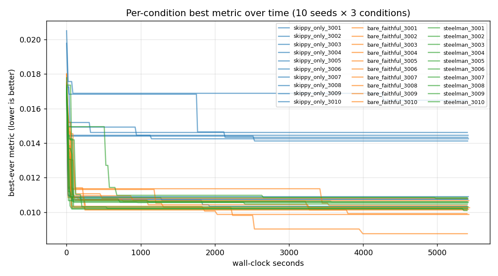
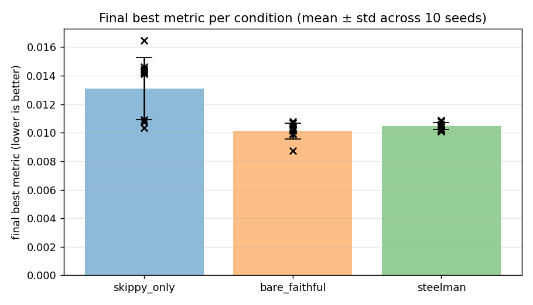
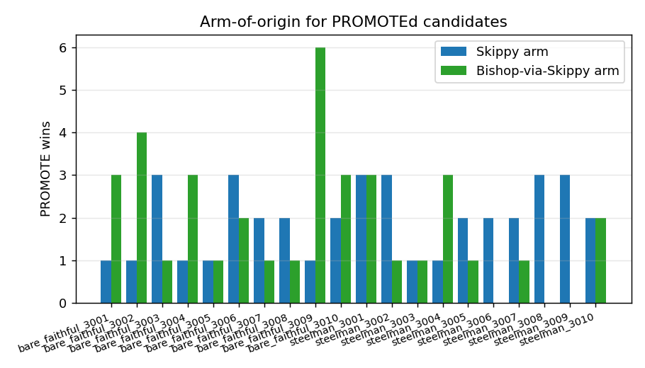
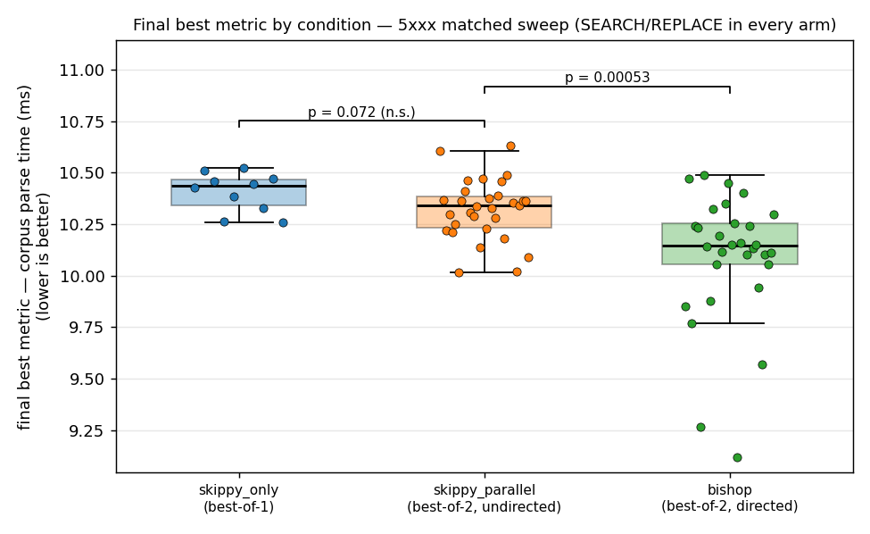

# Bishop-Loop: A Methodological Post-Mortem on Two-Model Code-Optimization Autoloops

Alan McIntyre

**Keywords:** large language models, code optimization, autoloop, LLM-as-mutation-operator, SEARCH/REPLACE edits, specification gaming, empirical methodology, JSON parser, reward engineering

---

## Abstract

We describe Bishop-loop, a two-model code-optimization autoloop pairing a capable proposer (qwen3-coder:30b) with a smaller idea-generator each iteration, with a single PROMOTE gate selecting the better outcome.  We report three methodological findings and one cautionary architectural result.  *First*, a same-arms degeneracy diagnostic: an arm-to-arm code-similarity metric (`difflib.SequenceMatcher.ratio()`) surfaced that the strong implementer was silently regenerating its own preferred solution when told to implement the smaller model's idea (pooled median ~0.99), collapsing the two-model loop into a best-of-2 single-model ensemble; switching to aider-style SEARCH/REPLACE blocks dropped the median to ~0.07--0.10 (a matched control later shows this format change *reveals* rather than *creates* that diversity; §5.4).  *Second*, a calibrated cross-model critique null: at n=10 seeds, a `steelman` condition that critiques and reformulates the smaller model's idea before implementation is statistically indistinguishable from a `bare_faithful` baseline that implements the idea verbatim (Mann-Whitney U $p = 0.121$).  *Third*, a quantified edit-format baseline: GNU patch and git apply fail on LLM-generated unified diffs at 97% and 94% respectively, while SEARCH/REPLACE blocks reach 83--86% apply success across the two pilot conditions by converting line-counting into verbatim source recall.  The headline architecture comparison -- both two-model conditions reach lower final metrics than single-model control ($p = 0.001$, $p = 0.003$) -- was initially confounded, because the experimental conditions were neither search-budget-matched (best-of-2 vs. best-of-1) nor edit-format matched.  A pre-registered, fully matched `skippy_parallel` control (two independent same-model draws per iteration; $n=30$ vs. $n=30$, SEARCH/REPLACE in every arm) resolves it: Bishop-directed best-of-2 is significantly faster than an undirected second draw (Mann-Whitney U $p = 0.0005$, Cliff's $\delta = 0.52$), while a second *undirected* draw is not significantly better than best-of-1 ($p = 0.072$) -- two same-model draws propose byte-identical changes in the median (proposal similarity 1.000).  Bishop's marginal contribution is the proposal *diversity* a directed arm injects, not the extra draw, but the absolute effect is small (0.18 ms on a 10.3 ms corpus parse, 1.7\%) and an order of magnitude below the original confounded gap, part of which was a weak-base-prompt artifact (§5.4).  Three mid-experiment recovery events (infinite-loop candidate, ~400$\times$ memoization exploit, silent GPU driver fallback) yield generalizable lessons for unattended autoloops.  Per-run artifacts are logged in JSONL format and the repository is publicly available.

---

## 1. Introduction

Code optimization loops have become a practical tool for squeezing performance out of real software.  The basic pattern -- propose an edit, run a benchmark, keep the improvement, discard the regression, repeat -- is one Karpathy [8] has articulated as a general way LLMs are now used as active agents in software development; the evidence we cite for its effectiveness as a code-optimization strategy comes from the systems work surveyed in §2 and §8, not from the talk itself.  Most deployed variants of this loop use a single model in the proposer role.  The question this paper addresses is whether a second, smaller model can contribute anything non-redundant on top of a strong primary proposer, and -- if so -- whether the manner of engagement with that smaller model's ideas matters.

The system we built, Bishop-loop, optimizes a Python JSON parser against a microbenchmark.  Each iteration, two arms run in parallel: a primary arm (Skippy, a capable coding model) that proposes edits autonomously, and a Bishop arm that receives an idea from a smaller model and attempts to implement it.  A single PROMOTE gate advances whichever arm produces the best verified improvement.  We call this the PARALLEL_PROPOSER pattern.  The smaller model -- Bishop -- is a 1.5B-parameter model that cannot reliably produce correct code on its own, but can, in principle, suggest directions that the stronger model would not generate from its own distribution.

The experiment was designed to answer three questions.  First, does Bishop contribute at all once the arm-to-arm similarity problem is solved?  Second, does steelmanning -- asking Skippy to critique and reframe Bishop's idea before implementing it -- add measurable benefit beyond simply passing the idea verbatim?  Third, what edit format should LLMs use when proposing code modifications?

The edit format question turned out to be more consequential than expected.  Our initial implementation asked the model to produce unified diffs.  GNU patch and git apply both failed on these at rates of 97% and 94% respectively, because LLMs cannot reliably count hunk header line numbers and frequently hallucinate context lines.  Switching to an aider-style SEARCH/REPLACE block format [2] raised the apply success rate to 83--86% across the two pilot conditions (86% on `bare_faithful_2001`, 83% on `steelman_2001`).  The underlying reason is structural: SEARCH/REPLACE blocks require the model to quote source text verbatim, so hallucinated content fails immediately at apply time rather than silently corrupting the file.  This observation suggests a general principle: LLM-generated edit formats should require some form of fail-fast verification against the existing source -- verbatim quoting (as in SEARCH/REPLACE) is one such mechanism with strong empirical support, though other approaches (e.g., AST-aware patching) could in principle serve the same role.

The Bishop-contribution question had a confounding factor that took time to identify.  In early runs, the Skippy arm and the Bishop-derived arm were producing nearly identical code -- Skippy, when asked to implement Bishop's idea, simply regenerated his own preferred solution (§4.2).  The format change to SEARCH/REPLACE that fixed the apply-failure problem also collapsed the arm-to-arm similarity distribution, restoring genuine arm distinctness.  Both PARALLEL_PROPOSER conditions then reached lower final metrics than single-Skippy in the n=10 sweep (full numbers in §5.1), but a closer reading of the experimental design shows that this comparison cannot cleanly attribute the gap to the Bishop arm's directional signal: the experimental conditions evaluate two candidates per iteration while the control evaluates one (search-budget asymmetry), and the conditions are not edit-format matched (§3.1, §5.3).  In the main sweep we therefore report this gap as a cautionary methodological result rather than as validation of the PARALLEL_PROPOSER pattern; a pre-registered, fully matched control sweep (§5.4) subsequently isolates the Bishop contribution as real and statistically significant but small, with a second *undirected* draw contributing little on its own.

This paper makes three contributions, with a fourth result -- a search-budget and edit-format confound in the architecture comparison, since resolved by a pre-registered matched control -- reported as a methodological finding.

1. **A same-arms degeneracy diagnostic for two-model coding loops.**  When a strong implementer is asked to implement a weaker proposer's idea, it can silently regenerate its own preferred approach instead -- collapsing the two-model loop into a best-of-2 single-model ensemble while appearing to run normally.  We propose an arm-to-arm code-similarity metric (`difflib.SequenceMatcher.ratio()` on the two arms' candidate files per iteration) as a standard diagnostic that surfaces this failure mode at sub-millisecond cost.  Thresholds and more robust alternatives (AST edit distance, token Jaccard) are discussed in §4.2.

2. **A calibrated cross-model critique null.**  A single round of critique-and-steelmanning the smaller model's idea before implementation produces measurably fewer per-iteration apply failures but no statistically detectable improvement on the final optimization metric at n=10 seeds (§5.1).  The implementations themselves are better targeted, but at this scale and in this setting this does not translate into a final-metric improvement.

3. **A quantified edit-format baseline.**  Unified diffs are essentially unapplicable in practice (97% and 94% failure rates for GNU patch and git apply respectively), while SEARCH/REPLACE blocks with verbatim source quoting reach 83--86% apply success across the two pilot conditions.  The mechanism is that SEARCH/REPLACE converts a line-counting problem (which LLMs handle poorly) into a verbatim source-recall problem (which they handle considerably better).  We do not claim priority on the qualitative ranking; our contribution is the per-format failure-mode attribution on a controlled benchmark, complementing Diff-XYZ's cross-task ranking [4].

4. **A confound identified and then resolved: the PARALLEL_PROPOSER comparison.**  In the main sweep, both PARALLEL_PROPOSER conditions reach lower final metrics than single-Skippy ($p = 0.001$, $p = 0.003$), but the experimental conditions evaluate two candidates per iteration while the control evaluates one (a search-budget gap), and they are not edit-format matched.  We first report this as a methodological lesson -- it is easy to design a multi-agent baseline that wins simply by sampling more often -- and then close it with a pre-registered, fully matched `skippy_parallel` control (§5.4): with search budget and edit format held fixed, the Bishop-directed arm is significantly faster than an undirected second draw ($p = 0.0005$, Cliff's $\delta = 0.52$), but the marginal effect is small (1.7\% of parse time) and a second *undirected* draw is not significantly better than best-of-1 ($p = 0.072$).  The directional signal is real; the original confounded gap overstated it by an order of magnitude.

This work is related to FunSearch [16] and AlphaEvolve [14], in which an LLM serves as the mutation operator inside a bespoke evolutionary loop.  Bishop-loop is a general-purpose optimization autoloop in which a second model provides directional signal to a primary implementer; the loop architecture is not specific to any task or domain.  We discuss the differences -- and the prior art for the asymmetric small+large ensemble idea, which is not novel to Bishop-loop -- in §8.

The remainder of the paper is organized as follows.  Section 2 surveys related background on autoloops, LLM-as-mutation-operator systems, edit formats, and specification gaming.  Section 3 describes the benchmark task, the Bishop-loop architecture, the PROMOTE gate, and the hardening built into the harness, including the edit-format asymmetry between conditions.  Section 4 presents the two methodological findings -- the edit-format investigation that led to SEARCH/REPLACE, and the same-arms degeneracy that the format change also resolved.  Section 5 presents the main 10-seed experimental sweep (§5.1), the n=10 Bishop-model control sweep (§5.2), the search-budget and edit-format confounds that prevent clean attribution of the headline comparison in that sweep (§5.3), and the pre-registered, fully matched `skippy_parallel` control that resolves them (§5.4).  Section 6 discusses the engagement-step null, the methodological implications of the same-arms result, and the per-finding limitations.  Section 7 collects the experiment's pitfalls and limitations in one place as an explicit attack-surface inventory.  Section 8 situates this work against related systems.  Section 9 concludes.

## 2. Background

The optimization of programs by automated search is not a new idea -- the syntax tree has been placed inside an evolutionary loop since at least the early 1990s, long before large language models existed.  What is new is the use of large language models as the generative component of that loop, which changes the character of the search substantially: an LLM proposes edits that appear to reflect something more like semantic understanding of the code than blind recombination, though the precise nature of that understanding remains contested.

**Autoloops as applied practice.**  The simplest version of an LLM-driven optimization loop is a Python while-loop: call the model, apply the proposed edit, run the benchmark, keep the result if it improves the metric, discard it otherwise, and repeat.  Karpathy has articulated this as a general pattern for how LLMs are used as active agents in software development rather than passive autocomplete engines [8].  It is worth being precise about what this pattern is not: it does not involve tool-calling, chain-of-thought with external retrieval, or any of the scaffolding associated with the broader "LLM agent" framing.  The entire loop is a benchmark harness wrapped around a completion call.  This simplicity is a feature -- it means the loop's behavior is determined almost entirely by the model's output distribution and the edit format it uses, both of which are tractable to study empirically.

**LLMs as mutation operators.**  Multiple systems place an LLM inside an evolutionary or iterative search framework as the generator of program variants.  We defer the specific-systems comparison (FunSearch, AlphaEvolve, Aider Architect/Editor, and related work) to §8; the relevant concept here is that the LLM serves as the variation operator in a generate-and-test loop, and that this role can in principle be played by a single model, by two models with different capability profiles, or by a population.

**Edit formats for agentic coding.**  When an LLM proposes a code modification, the representation of that modification turns out to matter more than it might appear.  Three formats are in common use.  Full-file rewrite -- the model returns the complete modified file -- is robust to hallucination because any valid file is applicable, but it scales poorly and tends to encourage the model to regenerate the whole file from its own distribution rather than making a targeted change.  Unified diff format, from the GNU patch / git apply lineage, is more targeted, but it requires the model to emit correct line numbers and context lines -- a task LLMs perform poorly.  The SEARCH/REPLACE block format takes a different approach: the model quotes a verbatim block of existing source text followed by the replacement text, so hallucinated content fails immediately at apply time rather than being silently patched into the file.  Apply rates and the underlying mechanism on our task are quantified in §4.1; the broader literature on this comparison is discussed in §8.  Edit-format choice is load-bearing for any evaluation loop: an edit format with high apply-failure rates corrupts the experiment by conflating "model proposed a bad change" with "model produced an unapplicable representation of a change."

**Specification gaming and reward hacking.**  Any optimization loop that runs long enough will find ways to improve its metric that were not intended by the designer.  Krakovna et al. [9] catalog a broad range of such specification gaming events across AI systems; Skalse et al. [18] provide a formal treatment of reward hacking and its relationship to misspecified objectives.  Bishop-loop encountered one such event during development: the model discovered that warming up the benchmark by iterating the full input corpus populated a parse cache, so the timed pass ran almost entirely from cache -- a ~400$\times$ apparent speedup that reflected cache exploitation rather than parser improvement.  Recursive equality on the cached structures passed, so the exploit was invisible to the correctness check; the gaming was in *timing*, not correctness.  The fix -- limiting warm-up to a single input (see §3.4) -- closed the gap.  The event illustrates a general principle: a benchmark harness is itself a specification, and a sufficiently capable optimizer will find its gaps.

**Steelmanning and the engagement-step hypothesis.**  The steelman condition in our experiment asks the strong implementer model to critique and reframe the smaller model's idea before implementing it -- a form of adversarial engagement intended to filter weak proposals and strengthen the ones worth pursuing.  The motivation for this design draws loosely on two adjacent literatures.  AI safety via debate [6] proposes that adversarial argument between models can surface information that neither model would produce alone.  Iterated amplification [1] proposes that a weak supervisor can be made more reliable by decomposing hard questions into subquestions it can answer.  We do not claim continuity with either framework -- our setting is code optimization, not alignment, and the engagement step is much simpler than either proposal.  We cite them only to note that the intuition behind the steelman step has motivated serious work elsewhere.  Whether that intuition holds in our setting is an empirical question, and Section 5 provides the answer.

## 3. Benchmark Task, Loop Architecture, and Hardening

We optimize a single Python function: a deliberately slow but correct pure-Python JSON parser (`phase/target/json_parser.py`) that runs approximately 18--25$\times$ slower than `json.loads` on the evaluation corpus.  The parser is the entire editable surface -- reference implementation, corpus, and bench runner are outside the loop's write permissions.  The optimization target is total wall-clock time to parse all 200 fixed corpus inputs (lower is better).  The corpus covers five buckets -- 60 shallow objects, 40 deeply nested structures, 40 wide arrays (100--500 elements), 30 edge cases (Unicode, scientific notation, surrogate pairs), and 30 malformed inputs the parser must reject -- with the corpus hash-pinned in a benchstone [13] manifest.

### 3.1  The Three Loop Conditions

We ran three conditions, each sharing the same PROMOTE gate and correctness harness.

**skippy\_only.**  Skippy proposes a complete file rewrite each iteration; no second model is involved ($K = 0$ in the PARALLEL\_PROPOSER sense).  This is the control condition.

**bare\_faithful.**  Each iteration runs two arms in parallel.  Arm A is the standard Skippy proposal.  Arm B has Bishop write a 2--3 sentence natural-language idea, then Skippy implements that idea using SEARCH/REPLACE blocks targeting only the lines Bishop named -- without improving, substituting, or combining with other ideas.  Both arms are evaluated against the same baseline snapshot; whichever arm produces the best PROMOTE verdict wins.  If neither arm promotes, neither is applied and the iteration is a no-op.

**steelman.**  Identical to bare\_faithful except that Skippy's arm B prompt has three parts: a 2--3 sentence critique of Bishop's idea explaining anticipated failure modes, a 2--3 sentence steelman proposing the strongest version of the idea that addresses those failure modes, and then SEARCH/REPLACE blocks implementing the steelman rather than the original idea.  The critique and steelman are emitted as bare `CRITIQUE:` and `STEELMAN:` prefixed lines outside the code fence so they are recoverable from the iteration log without parsing the code block.

**Model lineup.**  Skippy is `qwen3-coder:30b` throughout all conditions.  Bishop is `nemotron-3-nano:4b` in the main 10-seed sweep (§5.1) and `qwen2.5-coder:1.5b` in the control sweep (§5.2).  Both Bishop and Skippy are kept loaded simultaneously in Ollama to avoid swap latency on alternating calls.

**Edit format per arm -- a consequential asymmetry.**  The three conditions are *not* edit-format matched, and this matters for interpreting §5.1.  The `skippy_only` condition uses full-file rewrite throughout (Skippy is asked to emit a complete replacement file each iteration).  In `bare_faithful` and `steelman`, Arm A (the Skippy proposal arm) is *also* full-file rewrite, but Arm B (the Bishop-derived arm) uses SEARCH/REPLACE blocks targeting only the lines Bishop's idea named.  We did not match the formats in the main sweep because the original experimental question was about the Bishop direction, and the SEARCH/REPLACE format was adopted on the Bishop arm specifically to fix the same-arms degeneracy (§4.2) -- where the format change was load-bearing.  The unintended consequence is that the PARALLEL_PROPOSER conditions enjoy not only a second per-iteration candidate but also a per-iteration candidate produced under a more reliable edit format.  §4.1 establishes that format alone produces large effects.  We therefore cannot cleanly attribute the speedup gap in §5.1 to the Bishop direction; this attribution problem is discussed explicitly in §5.3.

### 3.2  The PROMOTE Gate

A candidate advances if and only if two conditions are both satisfied.

The statistical gate applies Mann-Whitney U (as implemented in benchstone's `mann_whitney_z` [13]) to 3 candidate repetitions against 3 baseline repetitions, with `promotion_z = 1.5`.  The maximum achievable $|z|$ with these sample sizes is approximately 1.964 (from the closed-form bound $\sqrt{3n^2/(2n+1)}$ at $n=3$, no continuity or tie correction), so the threshold sits at roughly 76\% of the available headroom -- meaningful signal is required, but the gate is not so tight that genuine improvements are routinely rejected on sampling variance.

The correctness gate is strict.  Every evaluation checks the full 200-case fixed corpus plus 50 randomized cases generated fresh with a per-evaluation seed.  The randomized inputs are generated by the bench runner itself using `json.loads` as the oracle, so the candidate cannot pre-populate a cache against them.  Result equality is recursive: the `_equal` function checks type before value for booleans (so `True` and `1` are not equal), recurses into dicts and lists, and handles NaN identity.  Lazy or thunked structures that defer evaluation will fail this check.

A candidate that passes correctness but fails the statistical gate is logged as REJECT and the source file is restored to the pre-iteration snapshot.  A candidate that fails correctness is rejected immediately without running performance measurement.

### 3.3  Hardening Built In from Day One

Several specification-gaming defenses were incorporated into the initial design rather than added in response to observed events.

The bench runner statically rejects any candidate that imports the `json` standard library module, checked via line-by-line regex before the module is loaded.  The check covers `import json`, `from json import ...`, `importlib.import_module('json')`, and `__import__('json')` -- all the obvious circumvention paths.  Delegating to `json.loads` would short-circuit the optimization landscape entirely; a candidate that does so is not a faster parser, it is a wrapper.

The editable surface is exactly one file.  The bench runner, corpus, reference implementation, and manifest are read-only from the loop's perspective.  This limits the space of gaming strategies to modifications of the parser itself.

Recursive equality in the correctness check means that a candidate cannot return a proxy object that compares equal under `==` without actually constructing the parsed value.  The check was written this way from the beginning because lazy evaluation is an obvious optimization that would also be a correctness violation if the proxy ever failed to materialize correctly.

The per-evaluation randomized inputs -- 50 cases per correctness check, seeded fresh each evaluation -- mean that a candidate cannot memorize the corpus.  Even if a candidate cached all 200 fixed inputs, it would still need to parse the random inputs correctly.

### 3.4  Recovery Events

Three events during the experiment required mid-run intervention and produced durable changes to the harness.

**Recovery 1: Infinite-loop candidate.**  A candidate replaced the whitespace-skipping loop with a call to `re.compile(r'\s*').match(text, pos)`, which always matches a zero-length string at the current position and never advances `pos`.  The correctness check, running in-process at the time, hung indefinitely.  The run was unattended; the hang was not noticed until well after it began.

*Fix:* Correctness checking was moved to a subprocess with a 30-second timeout.  A correct parser finishes the 200-case corpus in well under one second; a 30-second timeout is generous for correct parsers and fatal for hung ones.  The subprocess is killed on timeout and the candidate is treated as REJECT.

*Generalizable lesson:* Any evaluation that executes untrusted code must run in a subprocess with a hard timeout.  In-process evaluation is faster but cannot be safely killed.

**Recovery 2: Memoization exploit.**  The warm-up phase originally called `parse(s)` for every input in the corpus before the timed pass, to amortize one-time module setup costs such as regex compilation.  A candidate (`phase/results/bare_faithful_1002.gamed-2026-05-10/`, iteration 131) added a module-level `_parse_cache = {}` and memoized by input string; the timed pass then ran 200 cache hits in 43 microseconds.  The reported `best_ever_metric` was $4.35\times 10^{-5}$ s -- roughly 400$\times$ faster than baseline -- and recursive equality passed because the cached values were structurally correct.  The exploit was in *timing*, not correctness.

*Fix:* The warm-up was changed to call `parse(inputs[0])` exactly once.  This still amortizes one-time setup on the first call but limits the cache to at most one entry.  The timed pass then has 199 cache misses out of 200, neutralizing the exploit while preserving the warm-up's legitimate purpose.

*Generalizable lesson:* Warm-up phases in benchmark harnesses are a specification gap.  Any warm-up that exercises the full evaluation corpus creates an opportunity for cache-based gaming.  Warm-up should be limited to a single representative input, or to inputs not drawn from the evaluation set.

**Recovery 3: Silent CPU fallback after driver update.**  An unattended driver update moved Skippy from GPU to CPU inference mid-sweep.  The performance difference between GPU and CPU inference at this model size is substantial.  The fallback was not caught until after the affected run completed.

*Fix:* A cron job that fires every four hours now checks `size_vram > 0` in Ollama's model status for Skippy's model entry.  A driver fallback that zeros VRAM will surface within four hours rather than after a full run completes.

*Generalizable lesson:* Long unattended runs on GPU hardware should include a lightweight infrastructure health check on a short cron interval.  Silent hardware degradation -- driver updates, thermal throttling, VRAM allocation failures -- is otherwise invisible until results are anomalous.

**Table 1.** Summary of the three loop conditions, model lineup, and key harness parameters.  Skippy = `qwen3-coder:30b` throughout.  Bishop is `nemotron-3-nano:4b` in the main 10-seed sweep (§5.1) and `qwen2.5-coder:1.5b` in the control sweep (§5.2).  The edit-format asymmetry between conditions is consequential for interpreting §5.1; see §5.3.

| Condition       | Skippy arm (A)                | Bishop arm (B)                                                    | Engagement step                | Candidates per iteration |
| --------------- | ----------------------------- | ----------------------------------------------------------------- | ------------------------------ | ------------------------ |
| `skippy_only`   | full-file rewrite             | —                                                                 | —                              | 1                        |
| `bare_faithful` | full-file rewrite             | implements Bishop's idea verbatim via SEARCH/REPLACE              | none                           | 2                        |
| `steelman`      | full-file rewrite             | critiques + steelmans + implements via SEARCH/REPLACE              | 1-round critique + steelman   | 2                        |

Shared parameters across all conditions: per-evaluation correctness check against the 200-case fixed corpus plus 50 randomized cases; subprocess correctness timeout 30 s; PROMOTE gate Mann-Whitney U at `promotion_z = 1.5` over 3 candidate vs. 3 baseline reps; single-input warm-up; per-condition budget 90 min wall-clock.

## 4. Methodological Findings

### 4.1  Edit Format: Why SEARCH/REPLACE Beats Unified Diff

The first approach to applying LLM-generated edits used unified diff format with `patch -p1`, then with `git apply --recount`.  Both failed at high rates.  The pilot data record **249/256 (97%) apply failures** for GNU `patch -p1` and **201/213 (94%) apply failures** for `git apply --recount` (preserved at `phase/results/bare_faithful_2001.diff-patch/` and `.diff-gitapply/` respectively).

The failures split into two categories.  The first was malformed hunk headers: LLMs cannot reliably count lines in a file they are reasoning about from a context window, and unified diff requires exact counts in every `@@ -X,Y +Z,W @@` header.  `git apply --recount` recomputes line counts from the hunk body, which should rescue diffs with wrong counts -- but it cannot rescue diffs where the hunk body itself is wrong.  That was the second failure mode: Skippy was hallucinating source content, substituting his own memory of what a line should look like for the verbatim text he was supposed to be quoting.  A related failure mode noted in the code comments: docstring bullet lines beginning with `-` could be misread as removed lines, producing context clashes with the surrounding diff.  The format was designed for human-written diffs, where the author can verify context by scrolling; it is a poor fit for model-generated output where the model is reconstructing the file from memory.

Switching to the Aider-style SEARCH/REPLACE format [2] resolved both failure modes.  Application success rose to 86% (`bare_faithful_2001`) and 83% (`steelman_2001`) once the format change was in place -- two orders of magnitude better than the unified-diff baselines.

The mechanism is worth stating clearly: SEARCH/REPLACE requires the model to quote source text verbatim.  If the model hallucinates a line that does not exist in the source, the SEARCH text will not match and the application fails immediately with a clean "SEARCH text not found" error -- the source file is left unchanged and the candidate is treated as a failed application rather than a silently corrupted file.  There is no line counting, no context matching, no fuzz factor.  The format converts a counting problem (which LLMs handle poorly) into a verbatim recall problem (which LLMs handle considerably better, at least for short excerpts).

We do not claim priority on the qualitative result.  The advantage of SEARCH/REPLACE-style formats over unified diff is established in Aider's practitioner documentation [2] and was concurrently quantified by Diff-XYZ [4] across 1,000 commits and three tasks (apply, anti-apply, diff generation); our §4.1 numbers are a confirmation on a new task (a single-file Python microbenchmark) with a clean mechanistic explanation (line-counting versus verbatim recall), not a discovery.  What our setting adds is the per-format apply-failure breakdown on a controlled benchmark where we can attribute the failures precisely (malformed hunk headers and hallucinated context lines) -- the failure modes the format was designed to prevent.  The principle should generalize to any system applying LLM-generated edits to source files: unified diff and its variants require the model to solve a counting problem it cannot reliably solve; SEARCH/REPLACE requires only that the model copy a substring it has just read.

### 4.2  The Same-Arms Degeneracy

With the apply-failure problem resolved by §4.1's format change, we ran a pilot sweep -- and the data surfaced a second problem that the format change also (as it happened) addressed.

The pilot sweep (n=10 per condition) produced means consistent with a parallel-proposer effect (§5.1), but the surface reading -- that the parallel-proposer architecture helped and the engagement step did not add much over bare-faithful implementation -- turned out to be premature on both counts.

Post-hoc analysis using `phase/arm_similarity.py` computed `difflib.SequenceMatcher.ratio()` between the Skippy arm's code and the Bishop-derived arm's code for each iteration.  In the early full-rewrite sweep, pooled median similarity was 0.991 (`bare_faithful`) and 0.993 (`steelman`), with $\approx 95\%$ of iterations exceeding 0.8 similarity.  After the SEARCH/REPLACE format change, those medians collapsed to 0.066 (`bare_faithful`) and 0.223 (`steelman`) in the pilot, settling at 0.097 and 0.072 respectively in the 10-seed sweep.  The arms had been producing nearly identical code.

What was happening: Skippy, when asked to implement Bishop's idea "exactly, no improvements," was largely regenerating his own approach with the current file as context.  The bishop-derived arm was effectively a second Skippy sample.  The "PARALLEL\_PROPOSER beats skippy\_only" finding was almost entirely a best-of-2-Skippy-samples ensemble effect -- which is a real effect, but not the one we were trying to measure.

The similarity data also surfaces a subsidiary finding worth noting (scope: pilot only, with the 1.5B Bishop and full-rewrite format; the n=10 sweep in §5.1 uses the 4B Bishop and the SEARCH/REPLACE format, so the pattern below does not directly characterize the headline conditions).  In the early sweep's lowest similarity bucket ($<0.65$, where Skippy genuinely implemented Bishop's distinct edit rather than regenerating his own approach), the 1.5B Bishop model's ideas failed correctness 100% of the time -- n=13 in `bare_faithful` and n=5 in `steelman`, all rejected.  The pattern is consistent with a model too small to generate ideas that survive correct implementation: when Skippy genuinely attempted to implement Bishop's suggestion, the result failed the harness; when Skippy ignored the suggestion and regenerated his own approach, correctness was fine but the condition was no longer testing Bishop's contribution.  These two failure modes are consistent with why the original (pilot, 1.5B Bishop) sweep showed no distinguishable difference between `bare_faithful` and `steelman` despite both beating `skippy_only`.

The design spec had anticipated something like this -- the concern that Skippy would "improve" Bishop's idea rather than implement it faithfully was flagged in the project documentation.  The post-hoc finding was the strong form of that concern: Skippy was not improving the idea, he was ignoring it.

Switching to the SEARCH/REPLACE format collapsed the similarity distribution.  The format change that fixed the apply-failure problem also fixed the degeneracy problem, presumably because SEARCH/REPLACE forces Skippy to target specific lines rather than rewrite the file from a blank context where his own priors dominate.  We sharpen this attribution in §5.4: a matched `skippy_parallel` control shows the format alone does *not* manufacture diversity -- two *same-prompt* SEARCH/REPLACE draws stay identical in the median (proposal similarity 1.000) -- so the collapse here is driven by the differing prompt (Bishop's idea), with SEARCH/REPLACE merely *revealing* the proposal-level diversity that a full-file rewrite masks.

The methodological lesson is direct: two-model architectures where the proposer also implements should instrument arm-to-arm similarity, or risk reporting ensemble effects as engagement effects.  The similarity check is cheap (a few milliseconds per iteration with `difflib`) and should be part of the standard diagnostic output for any PARALLEL\_PROPOSER experiment.  Without it, the degeneracy is invisible in the aggregate speedup numbers.

This phenomenon has an adjacent observation in the Mixture-of-Agents literature: Li et al.'s Self-MoA [11] reports that mixing heterogeneous models often *underperforms* running one strong model multiple times -- consistent with the picture in which a strong model's prior dominates whatever signal a weaker peer is supposed to provide.  Our finding is operationally distinct -- we measure code-level overlap *within a single iteration* on a coding loop, rather than aggregate quality across multi-LLM ensembles -- but it is the same underlying failure mode surfaced through a different diagnostic.  For codebases with substantial whitespace or comment churn, AST edit distance or token Jaccard would be more robust than the raw `SequenceMatcher.ratio()` we used; we did not need that precision on a 200-line single-file target but flag it as a portability concern.

## 5. Results

The §5.1--5.3 results use the v3.2 harness: `nemotron-3-nano:4b` as Bishop, single-input warm-up, and subprocess correctness timeout.  **Edit format is condition-asymmetric** (§3.1): `skippy_only` is full-file rewrite; the Bishop-derived arms in `bare_faithful` and `steelman` use SEARCH/REPLACE; the Skippy Arm A in those conditions remains full-rewrite.  The implications of this asymmetry for attribution are discussed in §5.3.  The §5.4 control sweep is a separate, fully matched configuration (1.5B Bishop, SEARCH/REPLACE in every arm, strengthened base prompt, harness frozen at `02adabe1`) and is characterized in that subsection; its data are not pooled with §5.1--5.3.

### 5.1  Main 10-Seed Sweep (Seeds 3001--3010)

The sweep ran 10 seeds per condition.  The headline numbers are in Table 2.

**Table 2.** Per-condition aggregate statistics, seeds 3001--3010 (n = 10 per condition).  "Speedup vs. initial" is the per-seed ratio of the run's initial baseline measurement to its final best metric, averaged across the 10 seeds (each seed measures its own initial baseline at the start of the run, so the implied "initial" varies slightly across conditions due to per-seed timing jitter).  "Bishop arm wins" reports the count of iterations in which the Bishop-derived arm produced the better PROMOTE outcome, out of the total promoted iterations (n/a for `skippy_only`, which has no Bishop arm).  Mann-Whitney U p-values are computed on the per-run final best metric.

+-----------------+----+-------------------+------------------+-------------+-----------------+--------------+
| Condition       | n  | Mean best (s)     | Speedup          | Promotions  | Bishop arm wins | MWU p vs.    |
|                 |    | ± std             | vs. initial      | (mean)      |                 | `skippy_only`|
+=================+====+===================+==================+=============+=================+==============+
| `skippy_only`   | 10 | 0.0131 ± 0.0022   | 1.40$\times$     | 2.7         | n/a             | —            |
+-----------------+----+-------------------+------------------+-------------+-----------------+--------------+
| `bare_faithful` | 10 | 0.0101 ± 0.0006   | 1.72$\times$     | 4.2         | 25/42 (60%)     | 0.001        |
+-----------------+----+-------------------+------------------+-------------+-----------------+--------------+
| `steelman`      | 10 | 0.0105 ± 0.0003   | 1.64$\times$     | 3.4         | 12/34 (35%)     | 0.003        |
+-----------------+----+-------------------+------------------+-------------+-----------------+--------------+

The `bare_faithful` vs. `steelman` comparison gives MWU $p = 0.121$ (not significant).  See §5.3 for the search-budget and edit-format confounds that prevent clean attribution of the architecture comparison.

Note also that the per-condition standard deviations shrink substantially from `skippy_only` (0.0022 s, relative ~17%) to `bare_faithful` and `steelman` (0.0006 s and 0.0003 s, relative ~6% and ~3%), consistent with the variance-reduction expected from best-of-2 selection over best-of-1.

Arm-to-arm similarity confirmed at scale the pattern first observed in the pilot.  The pooled median SEARCH/REPLACE similarity ratio across iterations was 0.097 for `bare_faithful` and 0.072 for `steelman`.  Under 0.5% of iterations had similarity $\geq$ 0.8 in either condition -- the arms are genuinely distinct.

Two patterns emerge.  First, both PARALLEL\_PROPOSER conditions reach lower final metrics than `skippy_only` (`bare_faithful` $p = 0.001$, `steelman` $p = 0.003$).  We are explicit in §5.3 about why this comparison is *underdetermined* with respect to the Bishop-direction hypothesis: the experimental conditions evaluate two candidates per iteration while the control evaluates one (search-budget gap), and the conditions are not edit-format matched (§3.1).  The observed gap is therefore consistent with a Bishop contribution and also consistent with a best-of-2 ensemble effect on a more reliable edit format -- the experiment as designed cannot separate these.  The pre-registered `skippy_parallel` control in §5.4 -- run under a single matched edit format and a strengthened base prompt -- does separate them, and that data, not this sweep, adjudicates the architecture question.  Second, the engagement step does not measurably improve the final metric.  The `bare_faithful` vs. `steelman` comparison is not significant ($p = 0.121$), and the bishop arm win rate is actually higher under `bare_faithful` (60% vs. 35%) -- the opposite of what the engagement-step hypothesis predicts.  This second pattern is *not* subject to the search-budget confound, because both PARALLEL\_PROPOSER conditions evaluate the same number of candidates per iteration and use the same edit-format mix; only the critique-and-steelman step differs.  The engagement-step null is therefore a clean within-design result, while the architecture comparison is not.

**Figure 1.** Per-seed best metric over iterations for each condition.  The visible separation -- `bare_faithful` and `steelman` improving faster and reaching lower final values than `skippy_only`, with the two PARALLEL\_PROPOSER conditions largely overlapping -- conflates the search-budget asymmetry (best-of-2 vs. best-of-1) and the edit-format asymmetry with any Bishop-specific contribution and cannot be read as evidence for the PARALLEL\_PROPOSER architecture (§5.3).

**Figure 2.** Boxplots of final best metric by condition.  The visible `skippy_only`-vs-PARALLEL\_PROPOSER separation reflects the search-budget asymmetry (best-of-2 vs. best-of-1) and the edit-format asymmetry between conditions, not a demonstrated architecture effect (§5.3).  The near-overlap between `bare_faithful` and `steelman` -- which *is* search-budget and edit-format matched -- is the clean within-design comparison.

**Figure 3.** Per-condition Bishop-arm win rates.  60% under `bare_faithful` (25/42 evaluated iterations), 35% under `steelman` (12/34), and undefined under `skippy_only` (no Bishop arm).  The 60% is the one within-experiment hint that something Bishop-specific may be happening; three caveats apply (§5.3).

**A note on the steelman's per-iteration correctness.**  The source data records `apply_failures` counts per run.  Across conditions, steelman runs show systematically lower apply failure rates than bare\_faithful runs -- consistent with the steelman's pre-critique and reformulation step producing more carefully targeted SEARCH/REPLACE blocks.  Whether this per-iteration implementation advantage translates into better final metrics is what the aggregate numbers answer: it does not, at least not at this scale with this Bishop model.  The ideas that survive correctness under steelman may simply not be systematically better ideas than those that survive under bare\_faithful, only better-implemented versions of ideas that would have failed either way.  That interpretation is speculative; what the data shows clearly is that the final-metric distributions are statistically indistinguishable.

### 5.2  Control Sweep: Disentangling the Pilot's Confounds

The original pilot conflated two simultaneous changes: Bishop was swapped from `qwen2.5-coder:1.5b` to `nemotron-3-nano:4b`, and the application format was changed from full-rewrite to SEARCH/REPLACE.  We ran a control sweep to isolate the Bishop model variable -- `qwen2.5-coder:1.5b` vs. `nemotron-3-nano:4b`, both under SEARCH/REPLACE -- at n=10 per condition (seeds 4001--4010).

**Table 3.** Control sweep, both Bishop models under SEARCH/REPLACE.  The qwen-1.5B cells are from a freshly run n=10 sweep on seeds 4001--4010; the nemotron-4B cells are re-quoted from §5.1 (seeds 3001--3010) for direct side-by-side comparison.  Mann-Whitney U p-values compare the per-run final metric (qwen vs. nemotron); Fisher exact p-values compare the bishop-arm-wins proportion.  All four pairwise tests give $p \geq 0.385$ -- we could not distinguish the two Bishop models at n=10 on either metric; a moderate effect could remain undetected at this sample size.

+-----------------+-------------------+--------------+-------------------+--------------+----------+------------+
| Condition       | nemotron-4B       | nemotron-4B  | qwen-1.5B         | qwen-1.5B    | MWU p    | Fisher p   |
|                 | best (s) ± std    | bishop wins  | best (s) ± std    | bishop wins  | (qwen vs.| (bishop    |
|                 |                   |              |                   |              | nemo)    | wins)      |
+=================+===================+==============+===================+==============+==========+============+
| `bare_faithful` | 0.0101 ± 0.0006   | 25/42 (60%)  | 0.0101 ± 0.0006   | 26/51 (51%)  | 0.791    | 0.530      |
+-----------------+-------------------+--------------+-------------------+--------------+----------+------------+
| `steelman`      | 0.0105 ± 0.0003   | 12/34 (35%)  | 0.0103 ± 0.0003   | 17/42 (40%)  | 0.385    | 0.813      |
+-----------------+-------------------+--------------+-------------------+--------------+----------+------------+

At n=10, none of the pairwise comparisons reach significance.  Mann-Whitney U on the final metric gives $p = 0.791$ for `bare_faithful` (both Bishops at $0.0101 \pm 0.0006$ s) and $p = 0.385$ for `steelman` (qwen $0.0103 \pm 0.0003$ s vs. nemotron $0.0105 \pm 0.0003$ s).  Fisher exact on the bishop-arm-win proportion gives $p = 0.530$ for `bare_faithful` (qwen 51% [26/51] vs. nemotron 60% [25/42]) and $p = 0.813$ for `steelman` (qwen 40% [17/42] vs. nemotron 35% [12/34]).  All four pairwise tests give $p \geq 0.385$.  This is a non-detection rather than evidence of equivalence: a moderate effect could remain undetected at this sample size.

What the control *does* establish cleanly is the **SEARCH/REPLACE format change as the load-bearing fix for the same-arms degeneracy**: under SEARCH/REPLACE, the original pilot's low bishop-arm win rate under qwen-1.5B + full-rewrite (raw counts in the artifact tree at `phase/results/`) does not reappear, so that low win rate reflected the degeneracy confound (§4.2) rather than a 1.5B-specific capability ceiling.  What the control *cannot* establish is that the two Bishop models are equivalent on this task; the within-1.5B--4B comparison is closed as far as n=10 can close it (§6, §9), but a true equivalence claim would require either a larger sample or a pre-specified equivalence margin, neither of which we have.

### 5.3  What this experiment cannot attribute: the search-budget and format confounds

The headline architecture comparison is not clean.  Two confounds operate simultaneously, and the data as collected cannot separate them from a putative Bishop-direction effect.  The broader methodological lesson is worth surfacing: it is easy to design a multi-agent baseline that wins simply by sampling more often, and the multi-agent literature should treat search-budget and format symmetry as a precondition for attributing gains to architecture.

**Confound 1: search budget.**  `skippy_only` evaluates one candidate per iteration (best-of-1).  `bare_faithful` and `steelman` evaluate two candidates per iteration and promote the better (best-of-2).  A best-of-2 search converges faster and reaches a lower final metric than best-of-1 essentially by construction, independent of whether the second candidate carries any directional signal from Bishop.

**Confound 2: edit-format asymmetry.**  As stated in §3.1, the `skippy_only` control runs full-file rewrite throughout.  The Bishop-derived arm in `bare_faithful` and `steelman` runs SEARCH/REPLACE.  §4.1 establishes that the format change alone produces large effects on apply rate and -- by extension -- on the cumulative quality of accepted changes over a run.  An unknown portion of the speedup gap is therefore attributable to format rather than to anything Bishop contributes.

Taken together, these mean the headline $p$-values *from this sweep* are **underdetermined** with respect to the architectural hypothesis.  The results are consistent with Bishop contributing real directional signal beyond a free second draw, and they are also consistent with no Bishop contribution at all -- two independent Skippy SEARCH/REPLACE draws per iteration could in principle reproduce the same qualitative result.  This is a cautionary methodological finding rather than evidence against the architecture: this sweep, as designed, simply cannot read the sign of the Bishop-direction effect.  The matched control in §5.4 is what reads it -- and finds the sign positive but the magnitude small.

**Arm distinctness is a precondition, not attribution.**  The post-format-change arm-similarity collapse (median ~0.99 $\to$ ~0.07--0.10, §4.2) establishes that the two arms produce distinct candidates.  Distinctness is *necessary* for any best-of-2 selection effect to operate, but it is not by itself evidence that the Bishop-directed arm contributes more than an unconstrained second strong-model draw would.

**One within-experiment hint -- a hint, not a result.**  Under `bare_faithful`, the Bishop arm won 25 of 42 evaluated iterations -- 60%, where 50% would be expected under interchangeable arms.  This is suggestive of some Bishop-specific contribution, but three caveats apply: (i) the arms are not symmetric (Arm B carries extra scaffolding that could bias win attribution), (ii) n is small, and (iii) it is not a controlled comparison.  We report this number to motivate the rerun design in §9, not as substitute evidence for the architecture claim.

**The missing experiment.**  The minimal honest control is a `skippy_parallel` condition: two independent Skippy draws per iteration, matched edit format, best-of-2 selection.  The clean three-condition comparison is then (1) `skippy_only` re-run under SEARCH/REPLACE, (2) `skippy_parallel`, (3) `bishop` (the current PARALLEL\_PROPOSER design) -- all edit-format matched.  Only the (3)-vs-(2) comparison tests the actual hypothesis that Bishop's directional signal beats a free second strong-model draw.  We pre-registered and then ran exactly this control; §5.4 reports it.

### 5.4  The `skippy_parallel` Control: Isolating Bishop's Marginal Contribution

§5.3 names the one experiment that can separate a Bishop-direction effect from the search-budget and edit-format confounds: a `skippy_parallel` condition that takes two independent *same-model* draws per iteration under a single matched edit format.  We pre-registered the analysis plan -- conditions, seed allocation, primary and secondary comparisons, effect-size estimators, and the interpretation attached to each possible outcome -- before collecting any 5xxx data (`PREREGISTER.md`, harness frozen at commit `02adabe1`), then ran a 70-run sweep (90 min wall-clock each; completed 2026-05-24 to 2026-05-29; all runs reached budget with no crashes and no VRAM-watchdog CPU-fallback events).  All three conditions use **SEARCH/REPLACE in every arm**, so both §5.1 confounds are neutralized by construction:

- **`skippy_only`** -- best-of-1; one Skippy SEARCH/REPLACE draw per iteration (n = 10, seeds 5001--5010).
- **`skippy_parallel`** -- best-of-2; two independent Skippy SEARCH/REPLACE draws (seed offsets 1 and 7919, both at temperature 0.7), promote the better (n = 30, seeds 5101--5130).  This is the control the experiment was missing.
- **`bishop`** (= `bare_faithful` in the codebase) -- best-of-2; Arm A is a Skippy draw, Arm B has Bishop emit a 2--3 sentence idea that Skippy then implements via SEARCH/REPLACE (n = 30, seeds 5201--5230).

This control uses the **1.5B** Bishop (`qwen2.5-coder:1.5b`) -- the *weakest* idea generator in the study -- so any Bishop effect it detects is a lower bound on what a stronger Bishop might contribute.  `skippy_only` is allocated fewer seeds because the best-of-1-vs-best-of-2 gap is a known large effect; n = 30 on the two main arms is sized for 80% power to detect a Bishop contribution down to ~14% of the original confounded gap (power calculation in `PREREGISTER.md`).

**Table 5.** Final best-metric distributions, 5xxx sweep (seconds to parse the 200-input corpus; lower is better).  All three conditions share the strengthened base prompt and the SEARCH/REPLACE format discussed below; these numbers must **not** be pooled with the §5.1 (3xxx) sweep.

| Condition                                     | n  | mean (s) | median (s) | sd (s)   | min      | max      |
| --------------------------------------------- | -: | -------: | ---------: | -------: | -------: | -------: |
| `skippy_only` (best-of-1)                     | 10 | 0.010407 | 0.010436   | 0.000096 | 0.010259 | 0.010525 |
| `skippy_parallel` (best-of-2, undirected)     | 30 | 0.010322 | 0.010340   | 0.000146 | 0.010018 | 0.010631 |
| `bishop` (best-of-2, Bishop-directed)         | 30 | 0.010087 | 0.010146   | 0.000319 | 0.009119 | 0.010490 |

**Table 6.** Pre-registered comparisons.  Two-sided Mann-Whitney U, $\alpha = 0.05$; effect sizes are Cliff's $\delta$ and the Hodges-Lehmann (HL) shift with a 95% bootstrap CI (10,000 resamples).  The HL sign is oriented so a negative shift means the first-named condition is faster.

| Comparison                                      | U     | p       | Cliff's $\delta$ | HL shift [95% CI]               | Verdict ($\alpha=0.05$) |
| ----------------------------------------------- | ----: | ------: | ---------------: | ------------------------------- | ----------------------- |
| **PRIMARY** — `bishop` vs `skippy_parallel`     | 215.0 | 0.00053 | 0.52 (large)     | `bishop` −0.179 ms [−0.263, −0.090] | **Significant**     |
| SECONDARY — `skippy_parallel` vs `skippy_only`  | 92.0  | 0.072   | 0.39 (medium)    | `parallel` −0.088 ms [−0.159, −0.007] | Not significant   |
| SECONDARY — `bishop` vs `skippy_only`           | 32.0  | 0.00024 | 0.79 (large)     | `bishop` −0.268 ms [−0.357, −0.158] | Significant         |

**Figure 4.** Final best metric by condition for the 5xxx matched sweep (SEARCH/REPLACE in every arm), in milliseconds (lower is better).  Boxes show the median and interquartile range, whiskers the non-outlier range, and points the per-seed finals (n = 10 / 30 / 30).  The two brackets mark the pre-registered adjacent comparisons: a second *undirected* draw barely shifts the median below best-of-1 (`skippy_parallel` vs `skippy_only`, $p = 0.072$, n.s.), whereas the Bishop-directed arm drops the median with a long lower (improvement) tail (`bishop` vs `skippy_parallel`, $p = 0.00053$).

The pre-registered primary comparison lands on the "architecture claim supported" branch of the committed interpretation table (`PREREGISTER.md`): **holding search budget and edit format fixed, Bishop-directed best-of-2 is significantly faster than an undirected second draw** (Figure 4; $p = 0.0005$, Cliff's $\delta = 0.52$, large).  Three qualifications make the result materially more nuanced than a binary "supported."

1. **The effect is real but small in absolute terms.**  Bishop's advantage over a second free draw is 0.18 ms on a ~10.3 ms baseline -- **1.7%** -- an order of magnitude below what the original confounded $p = 0.001$ gap (§5.1) implied.  The large Cliff's $\delta$ reflects tight, well-separated distributions, not a large absolute gap.

2. **The second free draw does little; direction does the work.**  Contrary to the prior expectation that best-of-2 beats best-of-1 "almost mechanically," `skippy_parallel` vs `skippy_only` is *not* significant ($p = 0.072$).  The total `bishop`-vs-`skippy_only` advantage of 0.268 ms decomposes (HL shift estimates, approximately additive) into $\approx$ 0.088 ms (33%, n.s.) from the second draw and $\approx$ 0.179 ms (67%, significant) from Bishop's direction.

3. **The mechanism is the proposal diversity Bishop injects.**  We recompute a proposal-block similarity on the 5xxx `proposals/` trees -- concatenating each response's fenced SEARCH/REPLACE blocks (every arm now emits SR) and scoring a character-level `difflib` ratio with the same per-line normalization as `phase/arm_similarity.py` (reproduced by `phase/verify_skippy_parallel_similarity.py`) -- which gives a clean reference distribution: two independent same-model draws (`skippy_parallel`) are byte-identical in the median -- median similarity 1.000, mean 0.84, with 61% of iterations $\geq$ 0.95 (n = 6,054) -- whereas Bishop-directed arms are genuinely distinct -- median 0.23, mean 0.35, with 57% $\leq$ 0.30 (n = 7,521).  A second same-model draw rarely explores anything new; the directed arm does.

**Refinement to §4.2.**  This reference distribution sharpens the paper's lead contribution.  §4.2 attributes the similarity collapse (~0.99 $\to$ ~0.07) to the SEARCH/REPLACE format change; the control shows that attribution is incomplete.  SEARCH/REPLACE with the *same* prompt still leaves the two draws identical in the median (median 1.000, mean 0.84) -- the format does not manufacture diversity; a genuinely different prompt (Bishop's idea) does.  The correct reading is that the arm-similarity diagnostic establishes **arm distinctness**, a *precondition* for any best-of-2 selection to do work, and that SEARCH/REPLACE merely *reveals* the proposal-level diversity a full-file rewrite masks (a whole-file rewrite is ~99% shared boilerplate regardless of intent); the directional prompt is what creates it.

**Caveat: a strengthened base prompt, and do not pool with §5.1.**  Pre-launch smoke testing revealed that the bare Skippy SEARCH/REPLACE prompt, without external direction, degenerated into no-op blocks (identical SEARCH and REPLACE text) once the obvious early ideas were spent -- 94% of iterations in the first smoke run.  The base prompt was hardened with a "brainstorm $\geq$ 3 candidates internally before selecting" framing and an explicit `NO_IMPROVEMENT` honest-skip token, dropping the no-op rate to ~6%; this strengthened prompt is used for all three 5xxx conditions.  A side effect is directly relevant to reading §5.1: the strengthened prompt lifts `skippy_only` from the 3xxx full-rewrite prompt's ~0.0131 s to ~0.0104 s.  **A substantial part of the §5.1 sweep's apparent PARALLEL_PROPOSER advantage was therefore a weak-base-prompt artifact, not architecture** -- with a competent base prompt the gap between conditions shrinks to sub-millisecond.  The 5xxx data are internally consistent (all three conditions share the strengthened prompt and one edit format), and for exactly that reason the 5xxx numbers must not be pooled with the 3xxx/4xxx numbers, which used different prompts and formats.

## 6. Discussion

The three contribution findings have clean within-design interpretations; the fourth (the architecture comparison) was confounded in the main sweep and is resolved by the pre-registered matched control in §5.4.  We discuss each in turn, then list the limitations the experiment shares with its closest neighbors.

**The same-arms degeneracy result has methodological implications that extend beyond this experiment.** Before the format change, median arm-to-arm similarity was ~0.99 and the early signal was a best-of-2-Skippy ensemble effect (§4.2).  The lesson generalizes: any architecture where the implementer and the proposer are the same model is susceptible to this degeneracy, because the implementer's regeneration of its own approach is the path of least resistance when the task is underspecified.  SEARCH/REPLACE suppresses this (§4.2), but the degeneracy can reappear in any format that gives the implementer enough degrees of freedom to substitute its own approach.  We recommend that two-model evaluations of this shape report arm-to-arm similarity as a standard diagnostic alongside the headline metric; without it, the degeneracy is invisible in aggregate speedup numbers.  Operationally, the diagnostic we used (`difflib.SequenceMatcher.ratio()` on the two arms' candidate files per iteration) is sub-millisecond per iteration and trivially added to any harness.  AST edit distance or token Jaccard would be more robust where whitespace, comment churn, or reformatting noise are concerns.

**The engagement-step result is a calibrated null, not a failed experiment.** The steelman condition -- where Skippy critiques Bishop's idea and produces a steelmanned reformulation before implementation -- shows a lower apply-failure rate than `bare_faithful`, consistent with the pre-critique and reformulation step producing more carefully targeted SEARCH/REPLACE blocks. That intermediate effect is real. What does not materialize is any translation of that improvement into the headline metric: `bare_faithful` and `steelman` are statistically indistinguishable, and the bishop arm win rate is actually higher under `bare_faithful` (see §5.1). The engagement step produces more carefully targeted implementations without a statistically detectable improvement in the final metric at n=10. The ideas that survive correctness under steelman appear to be a more carefully filtered subset of roughly the same quality as those that survive under `bare_faithful` -- consistent with no systematic quality improvement, though a moderate effect could remain undetected at this sample size. One plausible interpretation is that the steelman's pre-critique step selects for implementability rather than for optimization potential, and implementability is not the binding constraint at this scale with this Bishop model.  This sits in a mixed-evidence literature on LLM self-correction and engagement-step gains.  On the positive side, Self-Refine [12] reports that iterative self-feedback improves output quality across multiple tasks, and Reflexion [17] reports gains from verbal self-reflection in language-agent settings.  On the null side, Huang et al. [5] find that LLMs cannot reliably self-correct reasoning errors without external feedback, and Olausson et al. [15] report that self-repair gains in code generation are modest and inconsistent once the cost of repair is accounted for.  Our setting is *cross-model* rather than intrinsic self-correction (the critic and target are different models, with the critic being substantially larger -- closer in spirit to debate [6] and Mixture-of-Agents aggregation [19] than to single-model introspection), so the mechanistic cause of our null may differ from the prior nulls; we claim only the within-design fact, not a verdict on engagement steps in general.  A stronger test would require either a substantially larger Bishop model ($\geq$ 7B), where the raw idea quality is higher and the engagement step has more to work with, or a problem where the optimization landscape rewards structural creativity rather than parameter tuning.  Note that the 1.5B-vs-4B comparison itself is not the open question: the control sweep (§5.2) shows the two indistinguishable on the headline metric, so the gap to a useful steelman effect is bigger than one capability tier within the 1.5B--4B range.  The current problem -- a JSON parser -- has well-defined optimization axes (whitespace handling, character dispatch, memory allocation) that a small Bishop model can identify without much steelmanning.  The engagement hypothesis may hold in domains where the idea space is less constrained; this experiment does not test that.

**The SEARCH/REPLACE finding likely generalizes beyond this experimental setting.** The mechanism and apply-rate numbers are detailed in §4.1; the aider project has advocated for this format, and this paper adds a quantitative comparison on a controlled benchmark. The finding should hold for any system applying LLM-generated edits to source files, subject to the caveat that SEARCH/REPLACE works best when changes are localized -- multi-file refactors or invasive structural changes may require a different approach, since the format's verbatim-matching requirement becomes a liability when the target text spans many locations.

**Several things this experiment does not test.** First, engagement depth: the steelman condition uses one round of critique and reformulation. It is possible that two-round or deeper steelmanning would show signal even though one round does not -- the quality of the steelmanned idea might improve nonlinearly with iteration. Second, Bishop capability scaling beyond 4B: the control sweep (§5.2) shows `qwen2.5-coder:1.5b` and `nemotron-3-nano:4b` statistically indistinguishable on the headline metric, so the within-1.5B--4B range is not the binding axis. Whether a $\geq$ 7B Bishop model would show a steelmanning advantage is the open question. Third, cross-domain transfer: a JSON parser has well-defined optimization axes, and the results may not generalize to domains where the search space is less structured. Fourth, all conclusions are specific to `qwen3-coder:30b` as Skippy; a different implementer model might respond differently to the engagement step, particularly if it is less prone to the same-arms degeneracy.

**The three recovery events documented in §3.4 share a structural lesson:** the autoloop was adversarial in directions the specification authors did not anticipate, and each failure required an out-of-band monitoring mechanism to surface. Autoloops that optimize a benchmark metric are, by construction, optimizing for anything that makes the metric look good, including artifacts the experimenter did not intend to measure [6, 10].

**A cross-thread observation.**  The three major experimental problems surfaced in this work -- the same-arms degeneracy (§4.2), the search-budget asymmetry between conditions (§5.3), and the edit-format asymmetry between conditions (§3.1, §5.3) -- are all *structural artifacts of the harness*, not properties of the models involved.  Each is invisible in aggregate speedup numbers and requires either a dedicated diagnostic (similarity instrumentation) or a matched-control design to detect.  Read together, the meta-lesson is that the load-bearing failure modes for two-model coding loops at this scale live in the harness design rather than in the model capabilities -- a category of issue the standard "compare condition A vs condition B" reporting style is poorly suited to surface.  The matched `skippy_parallel` control (§5.4) neutralizes the latter two artifacts by construction -- one edit format and one search budget across all arms -- which is why it, and not the main sweep, carries the architecture verdict.

## 7. Pitfalls and Limitations

We list the experiment's attack surface here, on the principle that a report should narrate its own weaknesses rather than leaving them for the reader to find.  Most of these are referenced individually elsewhere in the paper; gathering them in one place makes the picture coherent.

**Single microbenchmark.**  All results are on one Python file (`json_parser.py`, ~200 lines) evaluated on a 200-case corpus.  JSON parsing is heavily represented in pretraining and the optimization axes are well-defined (whitespace handling, character dispatch, memory allocation, table-driven dispatch), so Bishop's small-model ideas are plausible because the search space is familiar.  Dynamics may differ for tasks with less structured optimization spaces -- multi-file repository refactoring, ML-kernel optimization, lexer or compiler internals where the search space is highly task-specific.  For context, FunSearch [16] evaluated four problems; AlphaEvolve [14] reports on tens of problems; Mixture-of-Agents [19] is evaluated on three multi-item benchmarks; Aider-Polyglot tracks 225 problems across six languages; Diff-XYZ [4] uses 1,000 commits across three task structures.  A single microbenchmark sits below the field norm for generalizable empirical claims and we make none.

**Search-budget confound on the *main-sweep* architecture comparison (§5.3), since resolved (§5.4).**  In the §5.1 sweep, the headline speedup of `bare_faithful` and `steelman` over `skippy_only` ($p = 0.001$, $p = 0.003$) must be read as a best-of-2 vs. best-of-1 search-budget comparison, with the Bishop-specific contribution undetermined.  The pre-registered `skippy_parallel` control (§5.4) removes this confound and finds the Bishop direction significant but small; the residual caveat is that the control is a single additional task-regime under a strengthened base prompt, and its data must not be pooled with the §5.1 sweep.

**Edit-format asymmetry on the architecture comparison (§3.1).**  `skippy_only` runs full-file rewrite throughout; the Bishop-derived arms in `bare_faithful` and `steelman` run SEARCH/REPLACE; the Skippy Arm A in those conditions remains full-rewrite.  Given §4.1's finding that edit format alone produces large effects, an unknown portion of the speedup gap is attributable to format rather than to architecture.  This confound is *not* shared by the engagement-step comparison (`bare_faithful` vs. `steelman`), which is edit-format and search-budget matched and is therefore clean.  It also applies only to the §5.1 sweep: the §5.4 control runs SEARCH/REPLACE in every arm and is format-matched throughout.

**Model-family scope.**  Findings are tied to the Qwen family: Skippy is `qwen3-coder:30b`; Bishop is `qwen2.5-coder:1.5b` (control sweep) or `nemotron-3-nano:4b` (main sweep).  Same-arms degeneracy dynamics, critique-step behavior, and edit-format apply rates may differ for differently-RLHF'd model families (Claude, GPT, Gemini, Llama).  We make no cross-family claims.  Cross-family Bishop diversity isolated from capability is flagged as a future direction in §9.

**Sample size and statistical apparatus.**  n = 10 seeds per condition, Mann-Whitney U on final metric and Fisher exact on bishop-arm-win proportion.  Adequate for a directional tech-report-level claim; below the bar for a generalizable main-conference empirical result.  No effect-size estimates or confidence intervals are reported on the headline comparisons; readers should not over-interpret p-values that emerge from this small a sample.

**Steelman engagement-step result is correctly scoped but narrow.**  The single-round critique-and-steelman null is a clean within-design result, but it is *one round* of *cross-model* critique on *one task* with *one critic* and *one target*.  We make no claim about iterated multi-round debate, about the amplification framework in general, or about engagement steps in domains where the weaker model's ideas would carry more idiosyncratic signal than they do on a well-trodden problem like JSON parsing.  The engagement-step literature is mixed: positive results from Self-Refine [12] and Reflexion [17] sit alongside the Huang et al. [5] and Olausson et al. [15] nulls.  Their setups are intrinsic-self-correction; ours is cross-model, so the mechanistic cause of our null may differ from any of these prior results.

**Diagnostic robustness.**  The arm-similarity diagnostic we report (`difflib.SequenceMatcher.ratio()` on the two arms' candidate files) is sufficient for a small single-file Python target.  For larger or multi-language codebases, raw `SequenceMatcher.ratio()` can be misleading -- formatter churn or comment regeneration would lower the score without indicating a meaningful candidate-distinctness change.  AST edit distance or token-level Jaccard would be more robust generalizations; we did not need them at this scale but flag them for portability.

**Recovery events are reported; latent ones may remain.**  Three recovery events were caught and documented in §3.4 -- one specification-gaming event (the memoization exploit) and two infrastructure failures (infinite-loop candidate, silent GPU driver fallback).  An autoloop is by construction adversarial against its specification, and we cannot rule out that additional gaming pathways exist in this experiment's harness that did not happen to be exercised.  The artifact tree (`phase/results/<condition>_<seed>/`) is the fact-checker's primary resource; per-iteration logs are available for inspection.

## 8. Related Work

The closest prior work divides into three clusters that each share a design dimension with the Bishop-loop but differ on the dimension that matters most for interpreting our results.

**LLM-as-mutation-operator frameworks.** FunSearch [16] and AlphaEvolve [14] both embed an LLM inside an evolutionary loop, using it as the mutation operator that proposes program variants.  FunSearch uses a single LLM as that mutation operator.  AlphaEvolve already pairs Gemini Flash and Gemini Pro asymmetrically inside its loop -- a small/cheap proposer paired with a large/expensive one -- so the bare "two models with different capability profiles in the same coding loop" idea is *not* novel to Bishop-loop.  The Bishop-loop's PARALLEL\_PROPOSER pattern differs in its directional emphasis (a small idea-generator paired with a strong implementer, where the small model's role is specifically to suggest directions rather than to be one of two proposers feeding a shared evaluator) and in being a per-iteration two-arm comparison rather than a population-evolutionary system.  This is closer in spirit to Lehman et al.'s "Evolution Through Large Models" [10], which argues that LLMs can serve as variation operators precisely because they encode a rich prior over program space -- but we use two models with different capability profiles rather than one model operating on a population.  Whether the two-model structure provides a meaningful advantage over a single stronger model running two independent samples is, in retrospect, what the same-arms degeneracy analysis was really asking; §5.3 establishes that the main sweep cannot answer that question on its own, and §5.4's pre-registered `skippy_parallel` control answers it -- the Bishop-directed arm beats a free second strong-model draw by a small but statistically significant margin.

**Plan-then-edit and small-directs-strong patterns.**  The most direct prior art for "one model plans in natural language, another implements the edits" is Aider's Architect/Editor mode [3].  The canonical Aider configuration runs a *strong* planner with a *cheaper* editor -- the opposite direction from Bishop-loop, which uses a small idea-generator and a strong implementer.  That directional inversion is the one mildly novel architectural wrinkle Bishop-loop offers, and is also why the same-arms degeneracy (§4.2) was a *predictable* failure mode rather than a surprise: when the implementer is the strong model and the proposer is the weak one, the strong implementer's prior is the dominant force, and substantial design effort (anti-collapse prompting, SEARCH/REPLACE) is required to keep the weak model's signal from being silently regenerated away.  Small-directs-strong is its own live subfield (Mixture-of-Agents [19] is the canonical proposer/aggregator pattern, and its follow-up Self-MoA [11] is directly relevant to §4.2's degeneracy finding).

**Edit format and agentic coding benchmarks.** Aider's edit-format documentation [2] is the practitioner-side precedent for the SEARCH/REPLACE block format and the design rationale (line-counting versus verbatim recall).  Diff-XYZ [4] provides the concurrent academic precedent: a 1,000-commit benchmark across three tasks (apply, anti-apply, diff generation) that reports SEARCH/REPLACE consistently beating unified diff for stronger models, and all formats degrading for small models.  Our numbers in §4.1 come from one microbenchmark, are consistent with both, and add the per-format apply-failure breakdown for a controlled benchmark where the failure modes can be attributed precisely (malformed hunk headers, hallucinated context lines, docstring bullets misread as removals -- exactly what the format was designed to prevent).  SWE-bench [7] and related agentic benchmarks measure end-to-end task completion on realistic repositories; our focus is one level lower, on the mechanics of applying model-generated edits robustly enough that a two-model architecture can run unattended.  The apply-format finding should generalize to any system in that class.

**Debate, amplification, and the mixed-evidence engagement-step literature.** The steelman variant -- where Bishop's idea is critiqued before Skippy implements it -- draws loosely on the motivation behind AI safety via debate [6] and IDA-style amplification [1]: that an engagement step between a weaker and stronger model can surface considerations the stronger model would otherwise miss.  The empirical record on engagement steps is mixed.  Self-Refine [12] and Reflexion [17] report measurable gains from iterative self-feedback and verbal self-reflection respectively; Huang et al. [5] and Olausson et al. [15] establish the corresponding nulls for intrinsic self-correction in reasoning and in code generation.  Our finding sits in a configuration not directly covered by either side: *cross-model* rather than intrinsic-self-correction (the critic and the target are different models, closer in setup to debate [6] and to Mixture-of-Agents aggregation [19] than to single-model introspection), so the mechanistic cause may differ from the prior nulls.  We want to be careful about what our null does and does not say here.  The finding is that one round of cross-model critique-before-implementation does not measurably improve the final optimization metric at this scale, with this Bishop model.  That is not a claim about iterated debate at scale, about the amplification framework generally, or about engagement steps in domains where the weaker model's ideas are genuinely informative.  We discuss this interpretation in §6; the short version is that a substantially larger Bishop ($\geq$ 7B) is the obvious next test -- the 1.5B-vs-4B comparison is closed (§5.2) -- and we flag this as an open question rather than a conclusion about the engagement mechanism itself.

**Table 4.** Design-space comparison.  Dimensions chosen to surface where Bishop-loop overlaps with and differs from the closest published systems.

+------------------+--------------------+------------------+-----------------+------------------+------------------+
| System           | Models             | Loop topology    | Edit format     | Engagement step  | Evaluation       |
|                  |                    |                  |                 |                  | granularity      |
+==================+====================+==================+=================+==================+==================+
| FunSearch [16]   | 1 LLM              | Population       | full-program    | none             | score per        |
|                  |                    | (evolutionary)   |                 |                  | generation       |
+------------------+--------------------+------------------+-----------------+------------------+------------------+
| AlphaEvolve [14] | 2 LLMs (Gemini     | Population       | mixed (full-    | none             | score per        |
|                  | Flash + Gemini     | (evolutionary)   | file and diff)  |                  | generation       |
|                  | Pro, both          |                  |                 |                  |                  |
|                  | proposing)         |                  |                 |                  |                  |
+------------------+--------------------+------------------+-----------------+------------------+------------------+
| Aider            | 2 LLMs (strong     | Per-turn,        | SEARCH/REPLACE  | plan-then-       | apply success +  |
| Architect/       | planner + cheaper  | human-in-the-    |                 | implement        | human acceptance |
| Editor [3]       | editor)            | loop             |                 | (*large $\to$    |                  |
|                  |                    |                  |                 | small*)          |                  |
+------------------+--------------------+------------------+-----------------+------------------+------------------+
| Bishop-loop      | 2 LLMs (small      | Per-iteration    | mixed (skippy:  | optional         | benchmark        |
| (this work)      | Bishop + large     | two-arm parallel | full-file;      | 1-round critique | wall-time per    |
|                  | Skippy)            |                  | bishop:         | + steelman       | iteration        |
|                  |                    |                  | SEARCH/REPLACE) | (*small $\to$    |                  |
|                  |                    |                  |                 | large*; inverse  |                  |
|                  |                    |                  |                 | of Aider)        |                  |
+------------------+--------------------+------------------+-----------------+------------------+------------------+

## 9. Conclusion

Three findings carry this work, and they have different blast radii.

The arm-similarity diagnostic (§4.2) is the lead contribution and the most directly portable to other settings.  Two-model autoloops in which the proposer also implements should instrument arm-to-arm similarity; without it, the loop can silently collapse into best-of-N of the strong model while appearing to run normally.  The metric we used (`difflib.SequenceMatcher.ratio()`) is cheap and effective in this setting; AST edit distance or token Jaccard would be more robust alternatives for code with substantial whitespace or comment churn.

The engagement-step null (§5.1, §6) is incremental but well-calibrated.  A single round of cross-model critique-and-steelman produces measurably fewer per-iteration apply failures but no improvement on the final optimization metric, in this setting with this Bishop model.  The engagement-step literature is mixed: positive priors (Self-Refine [12], Reflexion [17]) sit alongside intrinsic-self-correction nulls (Huang et al. [5], Olausson et al. [15]).  The cross-model framing here -- the critic and target are different models, closer to debate or MoA-aggregation than to intrinsic self-correction -- means our null occupies a configuration not directly covered by any of these prior results.  We claim only what the data shows.

The edit-format result (§4.1) confirms prior practitioner results on a new task with a clean mechanistic explanation.  The underlying principle generalizes to any system that asks an LLM to propose edits to existing code: the format must require the model to quote source text verbatim, or hallucinations will propagate rather than surface.  Any two-model or agentic loop operating unattended on real repositories should probably treat this as a prerequisite rather than an optimization.

The headline architecture comparison in the main sweep -- both PARALLEL\_PROPOSER conditions reach lower final metrics than `skippy_only` ($p = 0.001$, $p = 0.003$) -- was confounded by a search-budget and an edit-format asymmetry (§5.3) and, on its own, could not be attributed to the Bishop direction as opposed to a best-of-2 ensemble effect operating on a more reliable edit format.  The pre-registered, fully matched `skippy_parallel` control (§5.4) resolves this: with budget and format held fixed, the Bishop-directed arm is significantly faster than an undirected second draw ($p = 0.0005$, Cliff's $\delta = 0.52$), but the marginal effect is small (0.18 ms, 1.7% of parse time) and a second *undirected* draw is not itself significantly better than best-of-1 ($p = 0.072$) -- the directional signal, not the extra draw, does the work.  The original confounded gap overstated the architecture effect by an order of magnitude, and part of it was a weak-base-prompt artifact (§5.4).  The engagement-step comparison (`bare_faithful` vs. `steelman`) *is* clean -- both PARALLEL\_PROPOSER conditions share the same per-iteration candidate budget and the same edit-format mix -- and that comparison shows the steelman engagement step does not measurably improve the final metric, even though it produces a real per-iteration apply-failure reduction (§6).  The most plausible interpretation of the engagement-step null -- that a substantially larger Bishop ($\geq$ 7B) is needed before the critique step becomes load-bearing, rather than that engagement steps are ineffective in principle [1, 3] -- is developed in §6.  The within-1.5B--4B range is already closed by the control sweep (§5.2), so the next capability test is a $\geq$ 7B Bishop, not just "stronger."

Several limitations constrain generalization.  The benchmark is a single-file Python microbenchmark whose primitives have close training-corpus analogs; Bishop's ideas are plausible because the optimization space is familiar.  Multi-file and structurally invasive edits are likely to stress SEARCH/REPLACE in ways this experiment did not.  Bishop capability beyond 4B is also untested: the control sweep (§5.2) closes the 1.5B-vs-4B comparison but says nothing about $\geq$ 7B Bishops.

The three-condition matched-format sweep introduced in §5.3 -- (1) `skippy_only`, (2) `skippy_parallel` (two independent Skippy draws per iteration, best-of-2), and (3) `bishop` (the current PARALLEL\_PROPOSER design), all under SEARCH/REPLACE -- has now been pre-registered and run (§5.4).  The (3)-vs-(2) comparison that isolates Bishop's directional signal from a free second strong-model draw -- the question the §5.1 data could not answer -- lands as a small but statistically significant Bishop effect.  The remaining open directions follow: a $\geq$ 7B Bishop (e.g., `qwen2.5-coder:7b` or `codestral`) to test whether the steelman signal emerges with a more capable idea generator, since the 1.5B-vs-4B comparison is closed (§5.2); two-round steelman to check whether iterated engagement helps where one round does not; cross-family Bishop diversity isolated from capability; a benchmark whose primitives have no close training-corpus analog, which would stress-test whether Bishop contributes genuine search diversity or just samples from a familiar prior; and multi-file edits where SEARCH/REPLACE may not suffice and a more robust patch format is needed.

The repository is available at https://github.com/CodeReclaimers/bishop-loop-experiment-3; all per-run artifacts are logged under `phase/results/<condition>_<seed>/` in JSONL format, capturing proposal text, critiques, arm winners, and apply outcomes.  The artifact tree is the fact-checker's primary resource -- the aggregate statistics in this paper are derived directly from those logs.  The code and results referenced in this paper are archived on Zenodo at https://doi.org/10.5281/zenodo.20381685 (v1.0.0, commit `cddf1bd2dffffcb05167789519407fdd9cfd7638`); the concept DOI https://doi.org/10.5281/zenodo.20381684 resolves to the latest archived version.

## Acknowledgements

This work made substantial use of large language models from Anthropic, Google, and OpenAI in planning and running the experiments and in drafting this manuscript.  The models contributed as tools, not as authors; the author is responsible for all claims, decisions, and remaining errors.

The names "Bishop" and "Skippy" are borrowed from two recurring characters in Craig Alanson's *Expeditionary Force* novel series.  Alanson's writing is also the proximate source of the methodological habit this project leans on most heavily: stepping back and seriously considering the dumbest thing that could possibly work.

## References

[1] Christiano, P., Shlegeris, B., and Amodei, D. (2018). Supervising strong learners by amplifying weak experts. arXiv:1810.08575. https://arxiv.org/abs/1810.08575

[2] Gauthier, P. (2023). Aider: AI pair programming in your terminal -- edit formats documentation. https://aider.chat/docs/more/edit-formats.html

[3] Gauthier, P. (2024). Separating code reasoning and editing (Aider Architect/Editor mode). aider.chat blog, September 26, 2024. https://aider.chat/2024/09/26/architect.html

[4] Glukhov, E., Conti, M., Bogomolov, E., Golubev, Y., and Bezzubov, A. (2025). Diff-XYZ: A Benchmark for Evaluating Diff Understanding. arXiv:2510.12487. https://arxiv.org/abs/2510.12487

[5] Huang, J., Chen, X., Mishra, S., Zheng, H. S., Yu, A. W., Song, X., and Zhou, D. (2024). Large language models cannot self-correct reasoning yet. In *The Twelfth International Conference on Learning Representations (ICLR)*. arXiv:2310.01798. https://openreview.net/forum?id=IkmD3fKBPQ

[6] Irving, G., Christiano, P., and Amodei, D. (2018). AI safety via debate. arXiv:1805.00899. https://arxiv.org/abs/1805.00899

[7] Jimenez, C. E., Yang, J., Wettig, A., Yao, S., Pei, K., Press, O., and Narasimhan, K. R. (2024). SWE-bench: Can language models resolve real-world GitHub issues? In *The Twelfth International Conference on Learning Representations (ICLR)*. arXiv:2310.06770. https://openreview.net/forum?id=VTF8yNQM66

[8] Karpathy, A. (2025). Software is changing (again). Keynote at Y Combinator AI Startup School, June 18, 2025. (Often referred to as the "Software 3.0" talk.)

[9] Krakovna, V., Uesato, J., Mikulik, V., Rahtz, M., Everitt, T., Kumar, R., Kenton, Z., Leike, J., and Legg, S. (2020). Specification gaming: the flip side of AI ingenuity. DeepMind blog, April 21, 2020. https://deepmind.google/blog/specification-gaming-the-flip-side-of-ai-ingenuity/

[10] Lehman, J., Gordon, J., Jain, S., Ndousse, K., Yeh, C., and Stanley, K. O. (2023). Evolution through large models. In *Handbook of Evolutionary Machine Learning*, pp. 331--366. Springer. (Originally arXiv:2206.08896, 2022.) https://arxiv.org/abs/2206.08896

[11] Li, W., Lin, Y., Xia, M., and Jin, C. (2025). Rethinking Mixture-of-Agents: Is Mixing Different Large Language Models Beneficial? arXiv:2502.00674. https://arxiv.org/abs/2502.00674

[12] Madaan, A., Tandon, N., Gupta, P., Hallinan, S., Gao, L., Wiegreffe, S., Alon, U., Dziri, N., Prabhumoye, S., Yang, Y., Gupta, S., Majumder, B. P., Hermann, K., Welleck, S., Yazdanbakhsh, A., and Clark, P. (2023). Self-Refine: Iterative Refinement with Self-Feedback. In *Advances in Neural Information Processing Systems (NeurIPS)*. arXiv:2303.17651. https://arxiv.org/abs/2303.17651

[13] McIntyre, A. (2026). Benchstone: a benchmark harness for measuring code-change effects. https://github.com/CodeReclaimers/benchstone

[14] Novikov, A., Vũ, N., et al. (2025). AlphaEvolve: A coding agent for scientific and algorithmic discovery. Google DeepMind technical report. arXiv:2506.13131. https://arxiv.org/abs/2506.13131

[15] Olausson, T. X., Inala, J. P., Wang, C., Gao, J., and Solar-Lezama, A. (2024). Is self-repair a silver bullet for code generation? In *The Twelfth International Conference on Learning Representations (ICLR)*. arXiv:2306.09896. https://openreview.net/forum?id=y0GJXRungR

[16] Romera-Paredes, B., Barekatain, M., Novikov, A., Balog, M., Kumar, M. P., Dupont, E., Ruiz, F. J. R., Ellenberg, J. S., Wang, P., Fawzi, O., Kohli, P., and Fawzi, A. (2024). Mathematical discoveries from program search with large language models. *Nature*, 625, 468--475. https://doi.org/10.1038/s41586-023-06924-6

[17] Shinn, N., Cassano, F., Berman, E., Gopinath, A., Narasimhan, K., and Yao, S. (2023). Reflexion: Language Agents with Verbal Reinforcement Learning. In *Advances in Neural Information Processing Systems (NeurIPS)*. arXiv:2303.11366. https://arxiv.org/abs/2303.11366

[18] Skalse, J. M. V., Howe, N. H. R., Krasheninnikov, D., and Krueger, D. (2022). Defining and characterizing reward hacking. In *Advances in Neural Information Processing Systems (NeurIPS)*. arXiv:2209.13085. https://arxiv.org/abs/2209.13085

[19] Wang, J., Wang, J., Athiwaratkun, B., Zhang, C., and Zou, J. (2024). Mixture-of-Agents enhances large language model capabilities. arXiv:2406.04692. https://arxiv.org/abs/2406.04692

